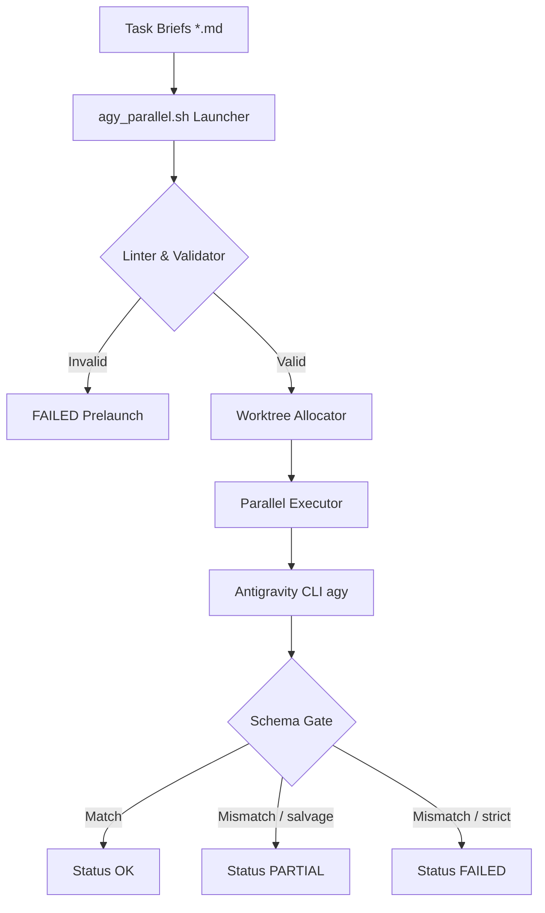
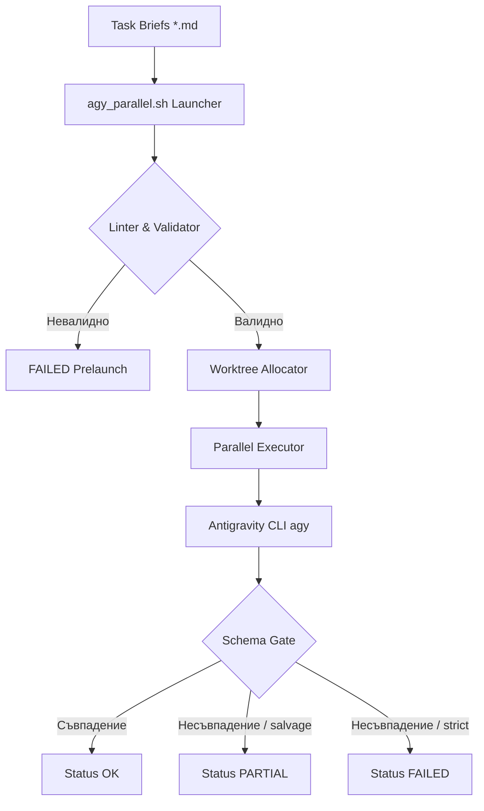

# agy-delegate
Claude Code skill: delegate implementation briefs to parallel Google Antigravity CLI (`agy`) agents with git-worktree isolation and a JSON-schema output gate. Version: 0.1.4.

[English](#english) · [Български](#български)

## English

### What it is
Turn Claude into a manager of Google Antigravity CLI (`agy`) agents. Claude does the judgment work—decomposition, briefs, and review—while agy handles the implementation volume.

### Prerequisites
- Google Antigravity CLI (`agy`) installed in a proot-distro `debian` container with the Termux wrapper at `~/.local/bin/agy`.
- A Google Pro/Ultra subscription (running this burns credits).
- The repository must live under `$HOME` (a requirement for the proot bind-mount).

### Install
Clone the private repository under `$HOME`, then run:
```bash
bash install.sh
```
This symlinks the repository into `~/.claude/skills/` (you can override this using the `CLAUDE_SKILLS_DIR` environment variable). The skill will then auto-trigger on phrases like "delegate to agy".

### The agy contract (critical)
This integration relies on a verified invocation contract for the `agy` CLI:
```bash
agy -p "PROMPT" --dangerously-skip-permissions --print-timeout 15m [--model "..."]
```
There is a hard rule: **`-p` binds the very next token as the prompt**. Every other flag must come AFTER the prompt, otherwise `--print` swallows the neighboring flag as prompt text. Since agy self-updates silently, if you notice behavior shifts, re-run the contract check (costs credits):
```bash
bash scripts/agy_parallel.sh --verify
```

### Usage
1. Copy `assets/brief-template.md` to create one brief per agent. Every section (Goal, Context, Scope, Requirements, Conventions, Verification, Done criteria) is required, as the launcher lints them. You can optionally include frontmatter for `model:`, `timeout:`, and `schema:`.
2. Launch the agents:
```bash
bash scripts/agy_parallel.sh --repo /path/to/repo briefs/*.md
```
This creates a worktree per brief on the `agy/<name>` branch and outputs logs in `.agy-runs/<ts>/`. The default is `--max-parallel 3`, and the exit code equals the number of failed agents.
3. The schema gate: When a brief declares a `schema`, the agent must output a matching JSON object. In the default `salvage` mode, valid fields are saved to `<name>.partial.json` with `_missing`/`_invalid` keys, resulting in a `PARTIAL(schema)` status. You can alter this behavior via `--schema-mode strict|warn`.
4. Review step: Read the logs and run `git -C <repo> diff base..agy/<name>`. Run the tests yourself and merge manually—never trust agent self-reports.

### Statuses
The following statuses are defined in the skill:
`OK · PARTIAL(schema) · FAILED(exit|timeout|quota|schema|schema-file|empty-brief|bad-timeout|worktree)`
The process exit code counts every `FAILED` item. `PARTIAL` statuses never fail the overall run.

### Testing
All automated tests use a stub `agy` to ensure zero credits are burned:
```bash
bash tests/test_agy_parallel.sh
bash tests/test_install.sh
pytest tests/ -q
```
The real-agy contract check is for humans to run only (costs credits):
```bash
bash scripts/agy_parallel.sh --verify
```

### Deployment note
Do NOT run the test suites from shared storage such as `/storage/emulated/0` (sdcardfs is mounted noexec, so the stub `agy` cannot execute and the launcher tests will fail spuriously). First copy the repository into `$HOME` (ext4), which is required anyway for the proot bind-mount.

### On quota
If you encounter `FAILED(quota)`, fall back to kimi-delegate, and then to native Claude subagents.

### Architecture Mapping


### Fault Handling Manual
| Status / Error | Root Cause | Mitigation |
| :--- | :--- | :--- |
| `FAILED(exit)` | The `agy` process terminated with a non-zero exit status. | Check the specific log in `.agy-runs/<ts>/<name>.log` for tracebacks or system errors. |
| `FAILED(timeout)` | The agent execution exceeded the timeout limit. | Increase the timeout limit in the command via `--timeout` or override in the brief's frontmatter. |
| `FAILED(quota)` | Credit or rate limits on the Google Pro/Ultra subscription were reached. | Switch to `kimi-delegate` or invoke native Claude subagents. |
| `FAILED(schema)` | The generated output failed validation against the provided JSON schema. | Inspect the output log. If in `salvage` mode, look at the parsed values in `<name>.partial.json`. |
| `FAILED(worktree)` | Git worktree creation failed (commonly because the branch or directory already exists). | Clean up leftover worktrees manually with `git worktree prune` and delete the offending branch. |

### Common Issues & Golden Rules
* **Golden Rule 1: Prompt Positioning Contract.** The `-p` flag in `agy` binds the very next token as the prompt. Any CLI flags must be specified *after* the prompt, otherwise they will be swallowed as prompt text.
* **Golden Rule 2: $HOME Directory Restraint.** Due to `proot` bind-mounting rules, the target repository and brief files must reside under `$HOME`. Run from ext4 storage, never `/storage/emulated/0`.
* **Golden Rule 3: No Unbounded Runs.** Never run parallel jobs without timeouts. The host wrapper enforces `timeout -k 10` to guarantee cleanup of hanging processes.

## Български

### Какво е това
Превърнете Claude в мениджър на агенти за Google Antigravity CLI (`agy`). Claude извършва аналитичната работа — декомпозиция, задания и преглед, докато agy поема обема от работата по имплементация.

### Изисквания
- Инсталиран Google Antigravity CLI (`agy`) в proot-distro `debian` контейнер с Termux wrapper на `~/.local/bin/agy`.
- Абонамент за Google Pro/Ultra (изпълнението изразходва кредити).
- Хранилището трябва да се намира под `$HOME` (изискване за proot bind-mount).

### Инсталация
Клонирайте частното хранилище под `$HOME`, след което изпълнете:
```bash
bash install.sh
```
Това създава символна връзка (symlink) на хранилището в `~/.claude/skills/` (можете да промените това чрез променливата на средата `CLAUDE_SKILLS_DIR`). След това умението се задейства автоматично при фрази като "delegate to agy".

### Договорът на agy (критично)
Тази интеграция разчита на верифициран договор за извикване на `agy` CLI:
```bash
agy -p "PROMPT" --dangerously-skip-permissions --print-timeout 15m [--model "..."]
```
Съществува строго правило: **`-p` обвързва следващия токен като промпт (prompt)**. Всеки друг флаг трябва да идва СЛЕД промпта, в противен случай `--print` поглъща съседния флаг как текст на промпта. Тъй като agy се обновява тихо, ако забележите промяна в поведението, изпълнете отново проверката на договора (струва кредити):
```bash
bash scripts/agy_parallel.sh --verify
```

### Употреба
1. Копирайте `assets/brief-template.md`, за да създадете по едно задание на агент. Всеки раздел (Goal, Context, Scope, Requirements, Conventions, Verification, Done criteria) е задължителен, тъй като стартерът (launcher) ги проверява. Можете по желание да включите frontmatter за `model:`, `timeout:` и `schema:`.
2. Стартирайте агентите:
```bash
bash scripts/agy_parallel.sh --repo /path/to/repo briefs/*.md
```
Това създава работно дърво (worktree) за всяко задание в клона `agy/<name>` и записва логове в `.agy-runs/<ts>/`. По подразбиране се използва `--max-parallel 3`, а кодът за изход (exit code) е равен на броя на неуспешните агенти.
3. Проверка на схемата (schema gate): Когато задание декларира `schema`, агентът трябва да изведе съответстващ JSON обект. В режима по подразбиране `salvage`, валидните полета се запазват в `<name>.partial.json` с ключове `_missing`/`_invalid`, което води до статус `PARTIAL(schema)`. Можете да промените това поведение чрез `--schema-mode strict|warn`.
4. Етап на преглед: Прочетете логовете и изпълнете `git -C <repo> diff base..agy/<name>`. Изпълнете тестовете сами и слейте (merge) ръчно — никога не се доверявайте на самоотчетите на агентите.

### Статуси
В умението са дефинирани следните статуси:
`OK · PARTIAL(schema) · FAILED(exit|timeout|quota|schema|schema-file|empty-brief|bad-timeout|worktree)`
Кодът за изход на процеса брои всеки елемент със статус `FAILED`. Статусите `PARTIAL` никога не маркират цялостното изпълнение като неуспешно.

### Тестване
Всички автоматизирани тестове използват макетен (stub) `agy`, за да се гарантира, че не се изразходват кредити:
```bash
bash tests/test_agy_parallel.sh
bash tests/test_install.sh
pytest tests/ -q
```
Проверката на договора с реалния agy трябва да се стартира само от човек (струва кредити):
```bash
bash scripts/agy_parallel.sh --verify
```

### Бележка за внедряване
НЕ изпълнявайте тестовите пакети от споделено хранилище като `/storage/emulated/0` (sdcardfs се монтира с флаг noexec, така че макетният `agy` не може да се изпълни и тестовете на стартера ще се провалят фалшиво). Първо копирайте хранилището в `$HOME` (ext4), което така или иначе е необходимо за proot bind-mount.

### При изчерпана квота
Ако срещнете `FAILED(quota)`, преминете към kimi-delegate и след това към нативните подагенти на Claude.

### Архитектурно описание


### Ръководство за отстраняване на неизправности
| Статус / Грешка | Причина | Решение |
| :--- | :--- | :--- |
| `FAILED(exit)` | Процесът `agy` завърши с ненулев изходен код. | Проверете съответния лог файл в `.agy-runs/<ts>/<name>.log` за грешки и изключения. |
| `FAILED(timeout)` | Времето за изпълнение на агента изтече. | Увеличете времето чрез параметъра `--timeout` или дефинирайте по-голям лимит във frontmatter на заданието. |
| `FAILED(quota)` | Достигнат лимит на квотата или изчерпани кредити на Google Pro/Ultra. | Превключете към `kimi-delegate` или нативните Claude subagents. |
| `FAILED(schema)` | Изходът не съответства на зададената JSON схема. | Проверете лог файла. В режим `salvage` разгледайте спасените полета в `<name>.partial.json`. |
| `FAILED(worktree)` | Грешка при създаване на git worktree (напр. съществуващ клон или папка). | Изчистете остатъчните работни дървета ръчно чрез `git worktree prune` и изтрийте проблемния клон. |

### Чести проблеми и Златни правила
* **Златно правило 1: Позициониране на промпта.** Флагът `-p` в `agy` обвързва следващия токен като промпт. Всички останали флагове трябва да се подават *след* промпта, в противен случай се поглъщат като част от него.
* **Златно правило 2: Ограничение до директория $HOME.** Поради изискванията на `proot` за bind-mount, хранилището и заданията трябва да са разположени в `$HOME` (ext4), а не в споделеното хранилище `/storage/emulated/0`.
* **Златно правило 3: Задължителен лимит за време.** Никога не стартирайте паралелни процеси без лимит за време. Скриптът налага `timeout -k 10` за гарантирано убиване на увиснали процеси.
